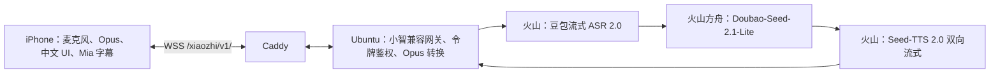

# Mia iOS：方案、进度与实施计划

更新日期：2026-10-05。开发分支：`feature/mia-ios-bootstrap`。本文是 iPhone 版 Mia 的统一进度与验收依据；仓库原有 ESP-IDF 固件继续独立存在。

**半身星雾 UI（已实现，CI 与两尺寸静态截图通过）**：用户最终恢复原版半身 Mia，批准[星雾首页](design/mia-approved-starmist-ui.png)，取消左上全部文字，以无麦克风图标的蓝紫粉流光球替换旧圆按钮和柱状波形。运行资源恢复 `MiaPortrait`，背景改为 `StarMistBackground`；原生 SwiftUI 流光按实际录音/播放音量变化，前景星雾与渐隐承接人物下沿。此前全身资产保留历史，不再用于当前首页或新视频默认参考。新末帧与提示词已同步，16 项视频工具测试通过。2026-10-05 用户确认另一次约 2.50 元 H3 5 秒 768P 生成，任务 `448953378521398` 成功；[带音效预览](design/launch/mia-starmist-preview-with-sound.mp4)与[抽帧](design/launch/mia-starmist-preview-contact.jpg)已保存。实际 768×1376、24 fps、5.167 秒，下沿持续星雾改善切口，但中途造型/尺度漂移和较亮凝形光带仍待验。原创音效按动作调整，视频帧与原片完全一致；实际账单、设备试听和原生首页交接未验。此为生成当时记录；用户随后选择静音视频接入，见下方最新状态。详见[制作记录](mia-launch-animation-plan.md)。

**静音启动版已选择接入**：用户取消音效并要求按静音版推送，现将[星雾静音视频](design/launch/mia-starmist-preview-silent.mp4)原样放入 `ios/MiaApp/MiaLaunch.mp4`。本地检查 H.264、768×1376、24 fps、124 帧、5.167 秒、无音轨，文件与预览哈希一致；播放器保持静音，未修改账号、语音或网关。CI 已加入真机包内资源一致性检查。[静音版 CI](https://github.com/bboytang/Mia/actions/runs/37250809373)（代码 `13dd7ce`）通过 49 项单元测试、2 项 UI 测试、模拟器与未签名真机编译、资源一致性检查；IPA 已上传。已下载核对 App 视频与源文件一致，并抽查 16 Pro/SE 实际录屏均有粒子、Mia 与回到首页。主录屏 177.15 秒、542 帧，SE 22.83 秒、443 帧，均无音轨；时长包含模拟器启动等待，不代表真机速度。结尾角色/流光球与原生布局有位置及尺度变化，未宣称像素级无缝；真机流畅度和衔接待验。音效候选保留制作历史，不再等待音效确认。

**账号接入（已批准，分阶段实施）**：用户回复“按方案实施”，采用[用户名＋密码设计](mia-account-access-plan.md)与[实施计划](superpowers/plans/2026-10-04-mia-account-access.md)。SQLite、受限异步 scrypt、账号 HTTP、本机密码重置及网关会话鉴权/用量已实现；本地全套 46 项服务端测试通过，账号持久化/HTTP 第一阶段 [CI](https://github.com/bboytang/Mia/actions/runs/37244006466)通过。旧共享令牌保留维护回滚，账号会话在连接与新收费回合前重验。iOS 登录及 VPS 账号部署尚未完成；当前 VPS 未更新账号代码，不把模拟语音测试记作真机登录通过。

**MiniMax 预览已生成**：用户确认仅重试一次，直接传入两张原图的任务 `448781796409606` succeeded。原片为 768×1376、24 fps、约 5.17 秒、124 帧、含一条音轨；[静音预览](design/launch/mia-minimax-preview-silent.mp4)仅移除音轨，逐帧解码哈希与原片相同。已抽九帧检查：能看到粒子凝聚、侧身转向、V 手势与下方圆环，但侧向幅度大于原定约 35 度，角色尺度/服饰中途变化，约 2.5–3.5 秒人物下沿有明显水平截断。未验收为正式启动素材，未加入 iOS。实际费用待账户核对，未再提交任务。原片、静音版和[清理元数据](design/launch/mia-minimax-preview-metadata.json)已保存。

跨设备继续开发请先读[Codex 交接说明](mia-ios-handoff.md)和[已确定视觉参考](design/README.md)。

## 目标与已确定的选择

Mia 是在 iPhone 上直接使用的中文语音伙伴。打开应用看到星雾背景和原版紫发半身角色，点击无图标流光球开始与结束说话；只显示 Mia 的回答字幕，随播放尽量逐字出现，不显示用户识别文本。最终角色必须是真正的 Live2D Cubism 模型，并由播放音量驱动嘴形。

| 项目 | 已确定方案 |
| --- | --- |
| 客户端 | iOS 17+、SwiftUI、中文界面、竖屏优先 |
| 语音协议 | 小智兼容 WebSocket v1、上行 16 kHz Opus、下行 24 kHz Opus |
| 交互 | 首版按键开始/结束说话；回答时可打断 |
| 云服务 | 火山豆包流式 ASR 2.0 → 方舟 `doubao-seed-2-1-lite-260915` → Seed-TTS 2.0 双向 WebSocket；百炼停用，旧 Provider 暂留回滚 |
| 服务器 | 中国内地 VPS，`43.143.230.174`；域名 `8kraw.cloud`；Caddy 提供 WSS，Python 网关只监听本机 |
| 凭据 | 云端两把 Key 分工不变；现有 iPhone 钥匙串保存网关令牌。用户已选择用户名＋密码账号，自动会话方案待设计确认和实施；仓库不保存密钥 |
| 编译安装 | GitHub Actions 的 macOS runner 生成未签名 IPA；用户自行签名安装。当前没有付费 Apple Developer 账号，不承诺 TestFlight/App Store |
| 角色 | 已选紫发黑紫赛博造型；当前是静态概念立绘，正式版须替换为获得授权的 Cubism 绑定模型 |

## 系统结构

客户端采集单声道 PCM 并编码为 Opus；网关把用户语音交给 ASR，把识别结果只用于对话模型，再把 Mia 的回答文字和 TTS 音频发回客户端。用户识别文本不进入主字幕。网关对输入录音设 30 秒上限，断开或打断时取消在途回答。2 核 2 GB VPS 只做协议、鉴权和云 API 编排，不在本机运行大模型。

字幕现在依靠音频播放完成回调，以约每秒 6 字推进。它满足“逐字出现”的视觉过程，但当前链路未提供字符级发音时间戳，因此不能声称字音严格同步。真实语速须在真机联调后校准。

首页只保留设置入口和无图标流光球主操作，原半身角色与仅 Mia 字幕保持视觉中心。流光在录音期间按输入音量变化、回答期间按播放音量变化，待机缓慢流动；保留点击开始/结束/打断，未增加后台声音唤醒。账号设计通过并实施后，普通设置展示登录账号和退出，旧令牌放高级维护。连接状态和错误提示保持可见。

## 当前进度与证据

2026-10-04 新增 [MiniMax H3 离线生成工具](mia-minimax-video.md)：官方中国 V2 创建/查询协议、首尾帧请求、隐藏 Key 配置、任务等待与下载已实现，14 项离线测试通过。准备请求不联网，实际付费生成需确认；真实创建已受理，首条任务失败，内嵌图片重试成功；视频质量与 App 衔接待验。用户选定在当前 Codex 工作环境运行，工具、项目虚拟环境与隐藏配置短入口 `bash /tmp/mia-minimax-key` 已就绪；无鉴权查询探测返回 HTTP 401，HTTPS 可达；用户已隐藏设置 Key，0600 权限已核对。配置后查询不存在任务返回 HTTP 500／`server_error`；随后真实创建已受理但素材读取失败，费用未核实。不再依赖 VPS SSH，不改现有 iOS 或火山语音链路。提交 `554c302` 的 [视频工具 CI](https://github.com/bboytang/Mia/actions/runs/37202954070)已通过；本地 98 项固件测试和 23 项服务端测试也通过。

| 工作项 | 状态 | 已有结果与边界 |
| --- | --- | --- |
| iOS 工程与 GitHub 编译 | 已完成 | XcodeGen 工程；构建代码 `305a45d` 的 [成功记录](https://github.com/bboytang/Mia/actions/runs/37213166341)：35 项测试、模拟器与未签名真机编译通过，上传 IPA、校验文件及两种尺寸录屏和首页截图；文档更新不会改变该 IPA。 |
| 首页视觉 | 半身星雾版已实现，CI 与静态截图通过 | 原 MiaPortrait、星雾前景承接下沿、无左上文字、无图标流光球；录音 RMS 和原生绘制已实现，已目视核对 16 Pro/SE 首页缩略截图。真实语音时流光反馈待 iPhone 验收。静态立绘没有 Live2D 动画和口型。 |
| 注册登录 | 服务端账号与网关接入通过测试；客户端/部署实施中 | 本地全套 46 项服务端测试通过，含新增账号 WebSocket 的 7 项回归；持久化/HTTP [CI](https://github.com/bboytang/Mia/actions/runs/37244006466)通过。账号撤销、过期、额度与全局并发已验证；iOS 和 VPS 尚未完成，当前生产仍是旧令牌。 |
| 启动动画 | 静音版已接入，CI 与两尺寸播放记录通过 | `ios/MiaApp/MiaLaunch.mp4` 为[星雾静音片](design/launch/mia-starmist-preview-silent.mp4)的原样副本：5.167 秒、24 fps、124 帧、H.264、无音轨。用户取消所有启动音效；现有播放/跳过/Reduce Motion/后台/超时逻辑保持，CI 增加真机包内资源一致性检查。新版 CI 通过 49 单元/2 UI 测试、两种编译及资源打包检查，两尺寸录屏均播放动画并回首页。位置/尺度并非像素级一致，真机流畅度和最终衔接待验。旧预览、音效与缺素材验证仅为历史。 |
| iPhone 语音管线 | 代码完成，真机待验 | WebSocket 握手、Opus 编解码、麦克风、播放、打断、尾帧补齐与轮次间采集关闭；模拟器测试通过，尚无真实 iPhone 录放反馈。 |
| 仅 Mia 字幕 | 代码完成，时序待校准 | 用户识别文本被忽略；Mia 字幕按播放回调推进。多句、真实语速和弱网情况待验。 |
| 火山网关迁移 | 服务器真实合成语音回合通过，外部 TLS 阻塞真机 | 新 Provider、网关选择及百炼回滚已推送；本地和 VPS 各 23 项服务端测试通过，[服务端 CI](https://github.com/bboytang/Mia/actions/runs/37150191264)通过。VPS 自身访问公网域名的真实链路通过，iPhone 仍无法完成 TLS 握手。 |
| VPS 部署 | 新进程与 Caddy 运行；外部域名访问待恢复 | 用户已在 VPS 设置两把火山 Key 并重启；VPS 自测返回 Mia 字幕、91 帧可解码 Opus。外部 443 在 ClientHello 后被重置；用户称域名备案正在审核。 |
| 正式 Live2D | 运行时方案已整理，实施输入缺失 | [接入方案](mia-live2d-runtime-plan.md)已确定 iOS 渲染和播放音量驱动边界；没有分层源稿、`.cmo3`、`.moc3` 或已绑定授权模型，SDK 未接入，不能进行 Cubism 运行时与口型验收。 |

### 2026-10-04 半身星雾首页核验

- 构建 `305a45d` 的 [iOS CI](https://github.com/bboytang/Mia/actions/runs/37213166341)全部成功；35 项测试包括新增 3 项 PCM RMS 测试，模拟器与未签名真机编译通过。
- 已目视核对 CI 导出的 [16 Pro](design/verification/mia-starmist-16pro-preview.jpg)与 [SE 第三代](design/verification/mia-starmist-se-preview.jpg)首页缩略截图，并经独立审查确认：字幕卡圆角和两侧约 22pt 间距完整，设置处于安全区域，星雾承接人物下沿，球体无麦克风图标。修复了放大的角色撑宽控件区域的问题；未修改语音协议。
- 本地使用项目虚拟环境运行 23 项服务端回归与 16 项视频工具测试，全部通过；[视频工具 CI](https://github.com/bboytang/Mia/actions/runs/37212337477)成功。半身末帧、提示词与工具默认参数一致，请求仅离线准备，没有创建新收费任务。
- 新产物 `Mia-iOS-unsigned-305a45d108152b31764ef262d76eee3389f45b4f` 已上传，记录有效期至 2027-01-02。最新启动录屏未逐帧验收；真实录音/播放的流光灵敏度、打断和正式视频衔接仍待真机，不能由静态截图推断。
- 用户名＋密码账号方案仍待书面设计确认；当前 App 仍显示旧网关令牌设置，未将账号设计记为已实现。

### 2026-10-03 继续开发核对

- 已核对本地工作分支 `feature/mia-ios-bootstrap` 与 GitHub 远端均指向 `98c90ed`，核对前工作树干净；三款角色比较图仍以**右侧第三款**为准。
- [iOS 构建](https://github.com/bboytang/Mia/actions/runs/37089783261)和[服务端 CI](https://github.com/bboytang/Mia/actions/runs/37089492807)的作业步骤均为成功。iOS 的 `Mia-iOS-unsigned-b05b6c99...` 产物尚未过期；其应用代码仍是 `b05b6c99`，后续文档提交不会生成新 IPA。
- 使用项目 `.venv/bin/python` 运行 `python -m unittest discover -s server/tests -v`，9 项通过；`bash -n server/deploy/install-ubuntu.sh` 和握手脚本的 `py_compile` 通过。受限沙箱内不能创建回环套接字，服务端测试在允许本地套接字的执行环境中重跑后通过。
- 迁移前美国 VPS 的 SSH 端口可达但需要密码，HTTPS 443 拒绝连接。这些探测结果不适用于现用中国内地 VPS；尚无 `mia-gateway`、Caddy TLS 或 WSS 握手成功的证据，步骤 1 仍待执行。
- 迁移前用户暂时无法登录旧 VPS；已有可用于后续联调的 iPhone。新 VPS 登录待核对。可登录后按[部署说明](../server/README.md)安装、配置 Caddy 并运行握手检查。仅回传 `systemctl status mia-gateway --no-pager`、`caddy validate --config /etc/caddy/Caddyfile` 和 `check_wss.py` 的结果摘要，不传密码、Key 或令牌。步骤 1 成功后再用重签 iPhone IPA 开始步骤 2。

### 2026-10-03 服务器地址变更

- 用户将 VPS 改为中国内地服务器 `43.143.230.174`；`8kraw.cloud` 已解析至新地址。地址变更时 SSH 22 可达，但登录尚未验证，HTTPS 443 拒绝连接；后续部署进度见下节。迁移前网络结果不能作为新服务器的验收依据。
- iOS 客户端和 WSS 握手工具继续使用 `wss://8kraw.cloud/xiaozhi/v1/`，无需改变应用端地址。先在新 VPS 完成网关与 Caddy 部署，再进行真机联调。

### 2026-10-03 新 VPS 部署进度

以下百炼鉴权记录是**历史排障记录**；百炼方案现已停止使用，不再等待百炼支持或新百炼 Key。当前执行顺序见下方“火山迁移”及分阶段计划。

- 已核对 SSH 主机指纹，并以专用公钥登录 `ubuntu`；`sudo` 可用。服务器为 Ubuntu 24.04.4 LTS，约 2 GB 内存、50 GB 系统盘。
- VPS 访问 GitHub 超时，已从本地提交 `70db0c8` 将 `server/` 传到 `/home/ubuntu/Mia/server`；创建 `mia` 服务账号和 `/opt/mia/.venv`，安装 `libopus0`、Caddy 与服务端 Python 依赖。虚拟环境 `pip check`、9 项服务端测试和安装脚本语法检查均通过。
- 已备份 Caddy 的初始配置，并启用仓库的 `8kraw.cloud` 反向代理模板。Caddy 已取得有效 TLS 证书；从外网请求 `https://8kraw.cloud/` 返回 HTTP 200。80/443 在 VPS 上监听。
- 用户首次输入的北京地域百炼 Key 含点号，旧安装器正则错误拒绝；已允许点号并将修复同步到 VPS。用模拟 Key 验证带点号输入能通过校验、带空格输入仍被拒绝，脚本语法检查通过。
- 用户已在 VPS 隐藏输入 Key 并安装服务；`mia-gateway` 处于运行状态，密钥文件仅 root 可读且权限为 `0600`，Caddy 配置校验通过。通过外网 `wss://8kraw.cloud/xiaozhi/v1/` 完成令牌和小智协议握手；部署计划中网关与 WSS 验收已完成。
- 最小北京百炼 `qwen-plus` 请求返回 HTTP 401、错误码 `invalid_api_key`。当前 Key 并未证明可用于北京地域按量付费接口；需用户取得对应 Key，在 VPS 隐藏更新且保留已生成的网关令牌，再重验 ASR、对话与 TTS。真机语音联调仍待此项完成。
- 用户截图确认已在北京地域按量付费 API Key 页面；当前 VPS Key 有新版 `sk-ws` 前缀。使用用户页面显示的业务空间专属地址重试仍返回 `401 invalid_api_key`，排除仅由共享 Base URL 造成的错误。新版 Key 明文只在创建或重置时显示一次。
- 已在现有 VPS 安装 `sudo mia-update-key` 短命令：隐藏读取新 Key，先用北京 `qwen-plus` 验证；只有请求成功才原子替换 `/etc/mia/gateway.env` 中的 Key 并重启网关，保留原网关令牌。脚本语法检查通过；用户上次输入未通过鉴权，配置未变。
- 用户重置后从创建弹窗直接复制了新的 115 字符 `sk-ws` Key；诊断显示与服务器旧 Key 不同、格式匹配，但共享地址和业务空间专属地址仍分别返回 `401 invalid_api_key`（Request ID：`6a321986-c988-9aaf-bf5a-afedf6d1c914`、`6baf411a-6ebc-9a95-b13e-e1237c8efdfe`）。VPS 出口 IPv4 为 `43.143.230.174`；该 Key 的 IP 白名单为空、访问模型范围开关关闭。无 Key 请求收到不同的“未提供 API Key”响应，说明百炼确实收到了带 Key 的请求。更新工具未改动密钥文件，网关仍运行。
- 用户随后新建了另一条独立的北京地域按量付费 Key（116 字符、权限“全部”）；`sudo mia-update-key` 仍收到 401 且未修改配置。使用该 Key 的双地址诊断结果仍为 `invalid_api_key`：共享地址 Request ID `26f72d52-308f-96d1-82e4-6a2721a7338a`，业务空间专属地址 Request ID `ca6e5588-374c-9994-9bae-55ea7961262d`。下一步需由阿里云百炼支持依据 Request ID 核查 Key 与账号/业务空间的鉴权状态；不要在工单中提供完整 Key。网关/WSS 可继续保持运行，但真实云语音与 iPhone 联调仍受阻。

### 2026-10-03 火山迁移

- 用户已在真实中国 VPS 独立验证三条 API：方舟北京 `doubao-seed-2-1-lite-260915` 返回 HTTP 200、内容 `OK`；Seed-TTS 2.0 双向 WebSocket 生成 171592 字节 24 kHz PCM；豆包流式 ASR 2.0 识别由该音频转换的 16 kHz PCM，结果为“你好，我是 Mia。这是实时语音测试。”这不等于新网关全链路已验证。
- 新 Provider 使用既定 ASR 二进制 WebSocket、方舟 HTTP 和 TTS 双向 WebSocket；TTS 以 VPS 实测成功脚本为准，在 `TaskRequest` 后发送 `FinishSession`，再接收 `TTSResponse` 音频。第一阶段 LLM 保持非流式。
- `VOLC_ARK_API_KEY` 仅用于方舟；一把 `VOLC_VOICE_API_KEY` 同时用于 ASR 和 TTS。安装脚本只预置空白字段并保留现有网关令牌；用户要求在代码部署完成后统一设置两把 Key。填 Key 前不得把旧进程的 WSS 成功当成火山网关验收。
- 提交 `dcc3dbd` 已推送到 `origin/feature/mia-ios-bootstrap`；[GitHub 服务端 CI](https://github.com/bboytang/Mia/actions/runs/37150191264)成功。本地与 VPS 的 23 项服务端测试、VPS `pip check`、Caddy 配置校验均通过。VPS 已备份旧代码及环境文件、安装新代码和空白字段；令牌与旧 Key 值均未变化，文件权限 `0600`，旧服务仍运行且公网 WSS 握手成功。当前仅完成静态部署，火山网关尚未重启或真实联调。
- 2026-10-04：用户在 VPS 设置两把火山 Key 并重启服务。新进程 `mia-gateway` 和 Caddy 均为 active；用既有 24 kHz TTS 合成音频转 16 kHz、编码 Opus，由**VPS 自身**经公网域名发起一轮真实对话，收到 Mia 回答字幕和 91 帧可解码 Opus（262080 字节 PCM），`tts` 状态为 `start → sentence_start → stop`，全程约 10.6 秒；错误令牌得到 WebSocket 1008。此验证覆盖服务器真实 ASR → LLM → TTS → Opus 链路，不证明外部网络可达。

### 2026-10-04 iPhone TLS 阻塞

- 用户已在 iPhone 填入正确的 `wss://8kraw.cloud/xiaozhi/v1/` 和网关令牌，但 5G 与 Wi‑Fi 均提示 “A TLS error caused the secure connection to fail”，无法进入语音阶段。iPhone Safari 曾对同一域名返回与 Mia 当前 Caddy 站点不一致的 `companion-x` JSON；后续无痕复测因网络中断未完成，不能据此确定手机实际到达哪个服务器。
- 国内外 DNS A 查询均返回 `43.143.230.174`，无 AAAA；VPS 本机 Caddy 证书链验证通过，`mia-gateway` 仍运行。另一外部环境的 TCP 443 可建立，但 TLS ClientHello 后被重置，服务器抓包显示连接在收到请求后由远端方向复位，没有完成 TLS；服务器本机访问该域名成功。此前的服务器 WSS 自测不能作为真机公网可达的证据。
- 用户确认 `8kraw.cloud` **尚未完成中国内地 ICP 备案或腾讯云接入备案**。[腾讯云域名故障说明](https://cloud.tencent.com/document/product/242/53667)将未备案/未接入列为中国内地服务器域名无法访问的原因。结合现象，备案限制是当前首要排查方向，但尚无腾讯云控制台拦截记录，不能断言为唯一原因。下一步由用户在腾讯云核对域名与实例的备案/拦截状态，按控制台要求完成备案；完成后重新从 iPhone 与独立外部网络验证 HTTPS/WSS，再继续真机语音。

### 2026-10-04 备案期间的 Live2D 接入准备

- 用户称域名备案正在审核。此期间已整理[Live2D 运行时接入方案](mia-live2d-runtime-plan.md)：使用官方稳定 Cubism 5 Native R5 的 iOS Metal 路线，由 SwiftUI 承载角色视图，并把播放音量采样与现有字幕完成回调分开。
- 此阶段只交付方案和验收顺序；未下载或接入 SDK/Core，未获得或加入正式模型，未改 iOS 代码，也未进行模型渲染或真机口型测试。运行时实施仍依赖获授权模型和 SDK 条款确认；备案通过后仍须完成外部 TLS 与 iPhone 语音联调。

### 2026-10-04 启动动画动作预览与播放准备

- 用户现选择自行在其他平台生成；[外部生成交付包](design/launch/mia-launch-external-generation-brief.md)提供粒子首帧、闭场参考、Mia 原立绘与完整提示词，公开下载内容已核对。正式视频仍未收到，下一步等待原始 MP4。
- 按用户选择，用 OpenArt 现有 40 积分提交一次 360p、5 秒动作生成；余额已用完，没有追加生成或购买。预览已保存并公开链接，抽取九个时点检查；中段角色一致性和水印仍待解决，不作为正式动画。
- 提交 `b7269de` 的 [iOS CI](https://github.com/bboytang/Mia/actions/runs/37194380347)成功：32 项测试、0 失败，其中十项为启动播放测试；模拟器与未签名真机应用编译成功。已目视检查 16 Pro（1206×2622）和 SE 第三代（750×1334）的首页截图。未签名应用包没有正式动画或测试黑色视频，仍直接进入原首页。
- 首轮录屏上传成功，但 16 Pro 约 123.89 秒、120 帧，SE 约 0.067 秒、仅一帧；SE 日志的录制就绪晚于应用启动。该轮仅验收测试及静态回退截图，因此继续修复就绪顺序。正式素材的两种尺寸衔接、真机流畅度与语音行为仍待验收。
- 后续修复 `9295439` 用真实 `Recording started` 信号替代固定等待；就绪、提前退出、超时三条临时进程检查通过。[新 CI](https://github.com/bboytang/Mia/actions/runs/37196200664)成功，32 项测试、0 失败；两台日志先确认录制就绪再启动。已解码新产物并检查首末帧和截图：首帧均为桌面，末帧均为原 Mia 首页；主录屏约 154.01 秒、47 帧，副录屏约 8.21 秒、67 帧。主片包含很长的 `simctl launch` 等待，不能用来推断真机启动速度。应用包仍没有正式动画或测试视频，不宣称五秒动态素材或最终衔接已验收。

## 分阶段执行计划

| 顺序 | 工作与交付物 | 完成判定 | 依赖 |
| --- | --- | --- | --- |
| 1 | **部署火山网关**：完成协议测试、旧网关回归、CI、代码和配置部署。 | **服务器自测已完成**：新进程运行，真实 ASR → LLM → TTS → Opus → WSS 回合通过；外部域名 TLS 仍待恢复。 | 代码与服务已部署。 |
| 2 | **真实语音联调**：完成域名备案/接入并恢复外部 TLS 后，用已签名 iPhone IPA 测试中文提问、识别、生成、人声播放和打断。记录首响、完整回答时长与单轮费用。 | 连续多轮语音可用；用户的话不显示；断线、超时和 API 错误有可理解的提示；费用记录可核对。 | 腾讯云备案/拦截状态确认及外部 TLS 恢复；用户自行签名安装 IPA。 |
| 3 | **字幕和体验收尾**：依据真实 TTS 音频校准字幕速度，处理多句排队、打断、耳机切换、弱网恢复、不同 iPhone 尺寸和辅助功能。功能入口按真机使用反馈定稿。 | 字幕随 Mia 播放平稳推进，不泄露用户识别文本；旋转/前后台/音频路由场景没有阻断性问题。 | 步骤 2 的真机反馈。 |
| 4 | **正式 Mia Live2D 素材**：按[素材交付说明](live2d-mia-asset-brief.md)制作并取得可随应用分发的分层源稿、Cubism 工程和运行文件。 | `.model3.json` 可在 Cubism 中完整加载；有眨眼、转头、呼吸、动作、表情与连续嘴部开合参数。 | 能完成 Cubism 分层与绑定的 Windows/macOS 环境或画师；当前尚未具备。 |
| 5 | **Live2D 接入**：按[运行时方案](mia-live2d-runtime-plan.md)在 iOS 工程中接入符合许可的 Cubism SDK，替换静态立绘；按播放音量驱动 `ParamMouthOpenY`，将聆听/思考/说话状态映射到动作。 | iPhone 上角色可正常渲染、眨眼及随 Mia 发声张合嘴；测量帧率、内存、发热和前后台恢复。 | 步骤 4 的合法绑定模型和 SDK 使用条款确认。 |
| 6 | **交付**：GitHub Actions 固定依赖并生成可复现的未签名 IPA；用户重签并完成真机验收，保留构建与部署说明。 | 所需场景验收通过；IPA、SHA-256 与配置说明在 GitHub 可找到。 | 步骤 2、3、5。 |

优先完成可实际语音聊天的步骤 1–3，再进行正式角色动画。Live2D 输入缺失不会被静态图、视频或模拟嘴形冒充完成。

## 部署、安全与费用边界

- 新 VPS 以专用 SSH 公钥登录 `ubuntu` 并通过 `sudo` 管理服务；密码不进入聊天或仓库。安装脚本预置空白火山字段，用户在部署完成后通过服务器终端填写；服务以独立 `mia` 用户运行，环境文件权限 `0600`。安装脚本不覆盖现有 Caddy 配置或网关令牌。
- 客户端默认地址为 `wss://8kraw.cloud/xiaozhi/v1/`；新安装注册/登录后自动获取会话，维护令牌只在高级维护中手动选择。网页证书由 Caddy 自动申请，须确认 DNS、80/443 端口和现有站点配置。
- 云 ASR、对话和 TTS 按火山实际计费；仓库内没有实时价格。上线前在控制台核对额度、地域与模型可用性，并在真实联调记录成本。
- 不持有 Apple 签名凭据；CI 产物不可直接安装，需用户自行重签。模拟器构建与测试成功不等同于 iPhone 麦克风、蓝牙及性能验收。

## 当前等待的外部结果

1. 用户称 `8kraw.cloud` 的备案正在审核。审核和腾讯云所需接入完成后，从独立外部网络重验 HTTPS/WSS，再用已安装 IPA 测试首次中文问答、声音、Mia 字幕、打断、连续多轮、耳机切换及 UI。**不要发送 Key、网关令牌或 SSH 密码**。
2. 提供获授权的、已分层绑定的 Mia Cubism 模型，并确认 SDK 使用条款。单张概念图无法直接生成真正的 `.moc3`；目前没有可执行绑定的设备或画师。[运行时方案](mia-live2d-runtime-plan.md)已经整理，实施与真机验收尚未进行。

### 2026-10-05 账号迁移实施与部署

- 用户批准用户名＋密码方案；持久化、HTTP、会话撤销、每日额度、全局并发与安装保留共 49 项服务端测试在本地、[CI](https://github.com/bboytang/Mia/actions/runs/37246004648)和 VPS 通过。火山 Provider、Opus、小智消息和字幕推进保持原结构。
- 发布 `abe1ae4` 的 [iOS CI](https://github.com/bboytang/Mia/actions/runs/37246486540)通过 49 项单元测试、2 项原生 UI 测试，真实 Keychain 更新/清除、来源隔离、断网/取消、离线退出和会话到期断开回归均通过；模拟器与未签名真机编译、两尺寸首页和测试截图已导出。首次注册即登录，新安装默认账号模式，旧令牌只供显式高级维护。
- 独立审查有一项重要问题（到期时进入登录页前未停录音），已先复现再修复并通过 CI；未发现其他具体阻断问题。模拟器测试使用专属权限和 ad hoc 签名以测真实 Keychain，真机 IPA 仍需用户自行签名。
- VPS 已发布该提交源码快照并重启账号网关，备份为 `/var/backups/mia/before-accounts-abe1ae4c4f0f/`，原环境文件内容逐字保留后补缺失账号项，Key/令牌没有轮换。Caddy 验证通过，只增本域名账号路由；8765/8766 均为 loopback，状态目录 mia `0700`、数据库 mia `0600`、环境文件 root `0600`。
- 真实 VPS 的本机 HTTP 与域名 HTTPS/WSS 均完成临时账号注册→登录→握手→退出→撤销/错误凭据拒绝；现有已撤销连接在新回合前被拒绝，不进入云 Provider；自测账号已清理。未新增付费语音或视频调用。
- 独立外部环境对 `https://8kraw.cloud/` 仍报 curl 35 / connection reset，公网 TLS 未恢复。备案/接入恢复后须用账号版 IPA 验收真实注册、中文录音、Mia 声音、仅 Mia 字幕、打断、退出和多轮；服务器自测不代替 iPhone。
