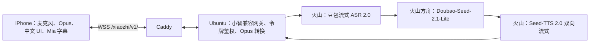

# Mia iOS：方案、进度与实施计划

更新日期：2026-10-03。开发分支：`feature/mia-ios-bootstrap`。本文是 iPhone 版 Mia 的统一进度与验收依据；仓库原有 ESP-IDF 固件继续独立存在。

跨设备继续开发请先读[Codex 交接说明](mia-ios-handoff.md)和[已确定视觉参考](design/README.md)。

## 目标与已确定的选择

Mia 是在 iPhone 上直接使用的中文语音伙伴。打开应用看到未来都市背景和紫发二次元角色，按麦克风开始与结束说话；只显示 Mia 的回答字幕，随播放尽量逐字出现，不显示用户识别文本。最终角色必须是真正的 Live2D Cubism 模型，并由播放音量驱动嘴形。

| 项目 | 已确定方案 |
| --- | --- |
| 客户端 | iOS 17+、SwiftUI、中文界面、竖屏优先 |
| 语音协议 | 小智兼容 WebSocket v1、上行 16 kHz Opus、下行 24 kHz Opus |
| 交互 | 首版按键开始/结束说话；回答时可打断 |
| 云服务 | 火山豆包流式 ASR 2.0 → 方舟 `doubao-seed-2-1-lite-260915` → Seed-TTS 2.0 双向 WebSocket；百炼停用，旧 Provider 暂留回滚 |
| 服务器 | 中国内地 VPS，`43.143.230.174`；域名 `8kraw.cloud`；Caddy 提供 WSS，Python 网关只监听本机 |
| 凭据 | `VOLC_ARK_API_KEY` 仅用于方舟；`VOLC_VOICE_API_KEY` 共用于豆包 ASR/TTS；iPhone 钥匙串仅保存网关令牌；仓库不保存密钥 |
| 编译安装 | GitHub Actions 的 macOS runner 生成未签名 IPA；用户自行签名安装。当前没有付费 Apple Developer 账号，不承诺 TestFlight/App Store |
| 角色 | 已选紫发黑紫赛博造型；当前是静态概念立绘，正式版须替换为获得授权的 Cubism 绑定模型 |

## 系统结构

客户端采集单声道 PCM 并编码为 Opus；网关把用户语音交给 ASR，把识别结果只用于对话模型，再把 Mia 的回答文字和 TTS 音频发回客户端。用户识别文本不进入主字幕。网关对输入录音设 30 秒上限，断开或打断时取消在途回答。2 核 2 GB VPS 只做协议、鉴权和云 API 编排，不在本机运行大模型。

字幕现在依靠音频播放完成回调，以约每秒 6 字推进。它满足“逐字出现”的视觉过程，但当前链路未提供字符级发音时间戳，因此不能声称字音严格同步。真实语速须在真机联调后校准。

首页当前只保留设置入口和麦克风主操作，角色、字幕和声波保持视觉中心。后续功能入口按真机反馈设计：设置页承载服务地址、令牌与音频选项；若加入台词回看，应提供独立入口并明确本地保存与清除方式；连接状态和错误提示保持可见。暂不加入只有装饰作用的按钮。

## 当前进度与证据

| 工作项 | 状态 | 已有结果与边界 |
| --- | --- | --- |
| iOS 工程与 GitHub 编译 | 已完成 | XcodeGen 工程；macOS CI 跑模拟器测试、真机编译，上传未签名 IPA、校验文件和首页截图。最新应用代码 `b05b6c99` 的 [构建成功记录](https://github.com/bboytang/Mia/actions/runs/37089783261)；文档更新不会改变该 IPA。 |
| 首页视觉 | 联调版完成 | 原创城市背景、选定 Mia 静态立绘、深色字幕板、声波和麦克风；已检查 GitHub 模拟器截图。静态立绘没有 Live2D 动画和口型。 |
| iPhone 语音管线 | 代码完成，真机待验 | WebSocket 握手、Opus 编解码、麦克风、播放、打断、尾帧补齐与轮次间采集关闭；模拟器测试通过，尚无真实 iPhone 录放反馈。 |
| 仅 Mia 字幕 | 代码完成，时序待校准 | 用户识别文本被忽略；Mia 字幕按播放回调推进。多句、真实语速和弱网情况待验。 |
| 火山网关迁移 | 代码与本地测试进行中 | 火山三条 API 已在真实中国 VPS 独立验证；新 Provider、网关选择及自动化测试须经 CI 和部署复核。百炼实现暂留回滚。 |
| VPS 部署 | 旧网关与 WSS 已验，火山待部署 | 专用 SSH、公网 HTTPS、Caddy TLS 和旧进程的 WSS 令牌握手已通过；火山代码与空白 Key 字段部署后，由用户统一填 Key，再做新网关真实全链路。 |
| 正式 Live2D | 输入缺失 | 没有分层源稿、`.cmo3`、`.moc3` 或已绑定授权模型，无法完成 Cubism 运行时与口型验收。 |

### 2026-10-03 继续开发核对

- 已核对本地工作分支 `feature/mia-ios-bootstrap` 与 GitHub 远端均指向 `98c90ed`，核对前工作树干净；三款角色比较图仍以**右侧第三款**为准。
- [iOS 构建](https://github.com/bboytang/Mia/actions/runs/37089783261)和[服务端 CI](https://github.com/bboytang/Mia/actions/runs/37089492807)的作业步骤均为成功。iOS 的 `Mia-iOS-unsigned-b05b6c99...` 产物尚未过期；其应用代码仍是 `b05b6c99`，后续文档提交不会生成新 IPA。
- 使用项目 `.venv/bin/python` 运行 `python -m unittest discover -s server/tests -v`，9 项通过；`bash -n server/deploy/install-ubuntu.sh` 和握手脚本的 `py_compile` 通过。受限沙箱内不能创建回环套接字，服务端测试在允许本地套接字的执行环境中重跑后通过。
- 迁移前美国 VPS 的 SSH 端口可达但需要密码，HTTPS 443 拒绝连接。这些探测结果不适用于现用中国内地 VPS；尚无 `mia-gateway`、Caddy TLS 或 WSS 握手成功的证据，步骤 1 仍待执行。
- 迁移前用户暂时无法登录旧 VPS；已有可用于后续联调的 iPhone。新 VPS 登录待核对。可登录后按[部署说明](../server/README.md)安装、配置 Caddy 并运行握手检查。仅回传 `systemctl status mia-gateway --no-pager`、`caddy validate --config /etc/caddy/Caddyfile` 和 `check_wss.py` 的结果摘要，不传密码、Key 或令牌。步骤 1 成功后再用重签 iPhone IPA 开始步骤 2。

### 2026-10-03 服务器地址变更

- 用户将 VPS 改为中国内地服务器 `43.143.230.174`；`8kraw.cloud` 已解析至新地址。地址变更时 SSH 22 可达，但登录尚未验证，HTTPS 443 拒绝连接；后续部署进度见下节。迁移前网络结果不能作为新服务器的验收依据。
- iOS 客户端和 WSS 握手工具继续使用 `wss://8kraw.cloud/xiaozhi/v1/`，无需改变应用端地址。先在新 VPS 完成网关与 Caddy 部署，再进行真机联调。

### 2026-10-03 新 VPS 部署进度

以下百炼鉴权记录是**历史排障记录**；百炼方案现已停止使用，不再等待百炼支持或新百炼 Key。当前执行顺序见下方“火山迁移”及分阶段计划。

- 已核对 SSH 主机指纹，并以专用公钥登录 `ubuntu`；`sudo` 可用。服务器为 Ubuntu 24.04.4 LTS，约 2 GB 内存、50 GB 系统盘。
- VPS 访问 GitHub 超时，已从本地提交 `70db0c8` 将 `server/` 传到 `/home/ubuntu/Mia/server`；创建 `mia` 服务账号和 `/opt/mia/.venv`，安装 `libopus0`、Caddy 与服务端 Python 依赖。虚拟环境 `pip check`、9 项服务端测试和安装脚本语法检查均通过。
- 已备份 Caddy 的初始配置，并启用仓库的 `8kraw.cloud` 反向代理模板。Caddy 已取得有效 TLS 证书；从外网请求 `https://8kraw.cloud/` 返回 HTTP 200。80/443 在 VPS 上监听。
- 用户首次输入的北京地域百炼 Key 含点号，旧安装器正则错误拒绝；已允许点号并将修复同步到 VPS。用模拟 Key 验证带点号输入能通过校验、带空格输入仍被拒绝，脚本语法检查通过。
- 用户已在 VPS 隐藏输入 Key 并安装服务；`mia-gateway` 处于运行状态，密钥文件仅 root 可读且权限为 `0600`，Caddy 配置校验通过。通过外网 `wss://8kraw.cloud/xiaozhi/v1/` 完成令牌和小智协议握手；部署计划中网关与 WSS 验收已完成。
- 最小北京百炼 `qwen-plus` 请求返回 HTTP 401、错误码 `invalid_api_key`。当前 Key 并未证明可用于北京地域按量付费接口；需用户取得对应 Key，在 VPS 隐藏更新且保留已生成的网关令牌，再重验 ASR、对话与 TTS。真机语音联调仍待此项完成。
- 用户截图确认已在北京地域按量付费 API Key 页面；当前 VPS Key 有新版 `sk-ws` 前缀。使用用户页面显示的业务空间专属地址重试仍返回 `401 invalid_api_key`，排除仅由共享 Base URL 造成的错误。新版 Key 明文只在创建或重置时显示一次。
- 已在现有 VPS 安装 `sudo mia-update-key` 短命令：隐藏读取新 Key，先用北京 `qwen-plus` 验证；只有请求成功才原子替换 `/etc/mia/gateway.env` 中的 Key 并重启网关，保留原网关令牌。脚本语法检查通过；用户上次输入未通过鉴权，配置未变。
- 用户重置后从创建弹窗直接复制了新的 115 字符 `sk-ws` Key；诊断显示与服务器旧 Key 不同、格式匹配，但共享地址和业务空间专属地址仍分别返回 `401 invalid_api_key`（Request ID：`6a321986-c988-9aaf-bf5a-afedf6d1c914`、`6baf411a-6ebc-9a95-b13e-e1237c8efdfe`）。VPS 出口 IPv4 为 `43.143.230.174`；该 Key 的 IP 白名单为空、访问模型范围开关关闭。无 Key 请求收到不同的“未提供 API Key”响应，说明百炼确实收到了带 Key 的请求。更新工具未改动密钥文件，网关仍运行。
- 用户随后新建了另一条独立的北京地域按量付费 Key（116 字符、权限“全部”）；`sudo mia-update-key` 仍收到 401 且未修改配置。使用该 Key 的双地址诊断结果仍为 `invalid_api_key`：共享地址 Request ID `26f72d52-308f-96d1-82e4-6a2721a7338a`，业务空间专属地址 Request ID `ca6e5588-374c-9994-9bae-55ea7961262d`。下一步需由阿里云百炼支持依据 Request ID 核查 Key 与账号/业务空间的鉴权状态；不要在工单中提供完整 Key。网关/WSS 可继续保持运行，但真实云语音与 iPhone 联调仍受阻。

### 2026-10-03 火山迁移

- 用户已在真实中国 VPS 独立验证三条 API：方舟北京 `doubao-seed-2-1-lite-260915` 返回 HTTP 200、内容 `OK`；Seed-TTS 2.0 双向 WebSocket 生成 171592 字节 24 kHz PCM；豆包流式 ASR 2.0 识别由该音频转换的 16 kHz PCM，结果为“你好，我是 Mia。这是实时语音测试。”这不等于新网关全链路已验证。
- 新 Provider 使用既定 ASR 二进制 WebSocket、方舟 HTTP 和 TTS 双向 WebSocket；TTS 以 VPS 实测成功脚本为准，在 `TaskRequest` 后发送 `FinishSession`，再接收 `TTSResponse` 音频。第一阶段 LLM 保持非流式。
- `VOLC_ARK_API_KEY` 仅用于方舟；一把 `VOLC_VOICE_API_KEY` 同时用于 ASR 和 TTS。安装脚本只预置空白字段并保留现有网关令牌；用户要求在代码部署完成后统一设置两把 Key。填 Key 前不得把旧进程的 WSS 成功当成火山网关验收。

## 分阶段执行计划

| 顺序 | 工作与交付物 | 完成判定 | 依赖 |
| --- | --- | --- | --- |
| 1 | **部署火山网关**：完成协议测试、旧网关回归、CI、代码和空白配置部署；用户最后在 VPS 统一设置两把火山 Key，重启服务。 | 新进程运行；真实 ASR → LLM → TTS → Opus → WSS 链路成功，令牌鉴权和 Caddy TLS 保持通过。 | 代码与配置部署、用户在 VPS 输入两把 Key。 |
| 2 | **真实语音联调**：用已签名 iPhone IPA 测试中文提问、识别、生成、人声播放和打断。记录首响、完整回答时长与单轮费用。 | 连续多轮语音可用；用户的话不显示；断线、超时和 API 错误有可理解的提示；费用记录可核对。 | 步骤 1；用户自行签名安装 IPA。 |
| 3 | **字幕和体验收尾**：依据真实 TTS 音频校准字幕速度，处理多句排队、打断、耳机切换、弱网恢复、不同 iPhone 尺寸和辅助功能。功能入口按真机使用反馈定稿。 | 字幕随 Mia 播放平稳推进，不泄露用户识别文本；旋转/前后台/音频路由场景没有阻断性问题。 | 步骤 2 的真机反馈。 |
| 4 | **正式 Mia Live2D 素材**：按[素材交付说明](live2d-mia-asset-brief.md)制作并取得可随应用分发的分层源稿、Cubism 工程和运行文件。 | `.model3.json` 可在 Cubism 中完整加载；有眨眼、转头、呼吸、动作、表情与连续嘴部开合参数。 | 能完成 Cubism 分层与绑定的 Windows/macOS 环境或画师；当前尚未具备。 |
| 5 | **Live2D 接入**：在 iOS 工程中接入符合许可的 Cubism SDK，替换静态立绘；按播放音量驱动 `ParamMouthOpenY`，将聆听/思考/说话状态映射到动作。 | iPhone 上角色可正常渲染、眨眼及随 Mia 发声张合嘴；测量帧率、内存、发热和前后台恢复。 | 步骤 4 的合法绑定模型。 |
| 6 | **交付**：GitHub Actions 固定依赖并生成可复现的未签名 IPA；用户重签并完成真机验收，保留构建与部署说明。 | 所需场景验收通过；IPA、SHA-256 与配置说明在 GitHub 可找到。 | 步骤 2、3、5。 |

优先完成可实际语音聊天的步骤 1–3，再进行正式角色动画。Live2D 输入缺失不会被静态图、视频或模拟嘴形冒充完成。

## 部署、安全与费用边界

- 新 VPS 以专用 SSH 公钥登录 `ubuntu` 并通过 `sudo` 管理服务；密码不进入聊天或仓库。安装脚本预置空白火山字段，用户在部署完成后通过服务器终端填写；服务以独立 `mia` 用户运行，环境文件权限 `0600`。安装脚本不覆盖现有 Caddy 配置或网关令牌。
- 客户端默认地址为 `wss://8kraw.cloud/xiaozhi/v1/`；首次使用需在设置中填网关令牌。网页证书由 Caddy 自动申请，须确认 DNS、80/443 端口和现有站点配置。
- 云 ASR、对话和 TTS 按火山实际计费；仓库内没有实时价格。上线前在控制台核对额度、地域与模型可用性，并在真实联调记录成本。
- 不持有 Apple 签名凭据；CI 产物不可直接安装，需用户自行重签。模拟器构建与测试成功不等同于 iPhone 麦克风、蓝牙及性能验收。

## 当前等待的外部结果

1. 完成火山 Provider 的 CI、部署和空白配置检查后，用户在 VPS 统一设置方舟与豆包语音两把 Key；随后重启并验证新网关完整语音链路。**不要发送 Key、网关令牌或 SSH 密码**。
2. 用户重签并在 iPhone 上测试 GitHub 的 IPA，反馈语音、字幕、耳机切换及 UI 实际表现。
3. 提供获授权的、已分层绑定的 Mia Cubism 模型。单张概念图无法直接生成真正的 `.moc3`；目前没有可执行绑定的设备或画师。
